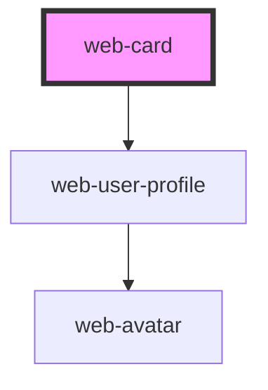

# web-card

<!-- Auto Generated Below -->

## Properties

| Property          | Attribute          | Description | Type           | Default     |
| ----------------- | ------------------ | ----------- | -------------- | ----------- |
| `backgroundCover` | `background-cover` |             | `string`       | `undefined` |
| `icon`            | `icon`             |             | `string`       | `undefined` |
| `profileArgs`     | --                 |             | `IProfileArgs` | `undefined` |

## Events

| Event                   | Description | Type               |
| ----------------------- | ----------- | ------------------ |
| `editUserPerfilClicked` |             | `CustomEvent<any>` |

## Dependencies

### Depends on

- [web-user-profile](../web-user-profile)

### Graph

----------------------------------------------

*Built with [StencilJS](https://stenciljs.com/)*
