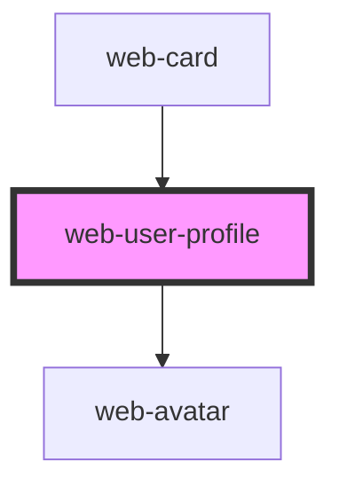

# web-user-profile

<!-- Auto Generated Below -->

## Properties

| Property         | Attribute         | Description | Type                | Default     |
| ---------------- | ----------------- | ----------- | ------------------- | ----------- |
| `coverThumbnail` | `cover-thumbnail` |             | `string`            | `undefined` |
| `direction`      | `direction`       |             | `"column" \| "row"` | `'column'`  |
| `name`           | `name`            |             | `string`            | `undefined` |
| `occupation`     | `occupation`      |             | `string`            | `undefined` |

## Dependencies

### Used by

 - [web-card](../web-card)

### Depends on

- [web-avatar](../../../Elements/web-avatar)

### Graph

----------------------------------------------

*Built with [StencilJS](https://stenciljs.com/)*
